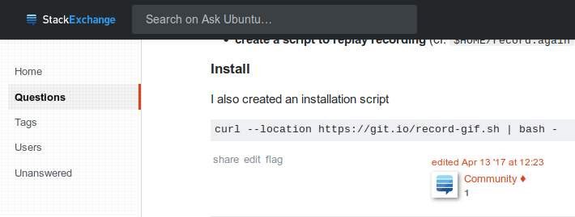

Package mis-management
======================

Hanno Böck & Benjamin Bach

Böck://
www.hboeck.de + Twitter:@hanno

Bach://
www.overtag.dk + Twitter:@benjaoming

---

Disclaimer
==========

* This talk was prepared very spontaneously.
* We don't claim to have all the solutions, but we want to point out problems we see.
* We don't want to blame the people running package managers. They're often volunteers with little support from the industry that uses their work.

---

Outline
=======

* Incidents
* Theoretical attacks
* Future

---

PyPi
====

149,452 pkgs (August 19)

*) http://www.modulecounts.com/

---

Typosquatting in Programming Language Package Managers
======================================================

Master Thesis by Nikolai Tschacher in March 2016

http://incolumitas.com/2016/06/08/typosquatting-package-managers/

---

Attack 1: standard library names
================================

Register python standard library names, hope someone will install them.

3929 installations of urllib2 in two weeks.

---

Attack 2: Typosquatting
=======================

Register slight variations and common typos of popular packages names (setuptols instead of setuptools).

---

After they finished that research they deleted all the packages they had registered.

So we could register them and count how many of them were installed.

https://pytosquatting.overtag.dk/

---

September 2017:

Slovakian CERT discovers packages with obfuscated setup code doing callbacks to a chinese IP.

http://www.nbu.gov.sk/skcsirt-sa-20170909-pypi/

---

PyPI now blocks all standard library names.

(Tested w/ Python 3.7)

---

PyPI did not block all the previously abused typo names.

We were able to re-register some of them yesterday

---

npm
===

680,893 pkgs (August 19)

---

Malicious packages in npm
=========================

Typo-packages send environment variables to attacker's server.

https://iamakulov.com/notes/npm-malicious-packages/

---

Backdoor in npm package getcookie
=================================

Deprecated package "mailparser" added pointless dependency to getcookie.

https://www.infoq.com/news/2018/05/npm-getcookies-backdoor

---

eslint incident
===============

Packages "eslint-scope" and "eslint-config-eslint" sent npm configuration file .npmrc to attacker's server.

Likely compromised developer account due to password reuse.

https://eslint.org/blog/2018/07/postmortem-for-malicious-package-publishes

---

Snap malware 1/3
================

Cryptocurrency miner disguised as the “systemd” daemon.

> At least two of the snap packages, 2048buntu and Hextris, uploaded to the Ubuntu Snaps Store by user Nicolas Tomb, contained malware.

---

Snap malware 2/3
================

Uploaded as proprietary software. No sources.

> Currently, it is impossible to establish the number of affected users because the Ubuntu Snap Store does not provide an install count.

---

Snap malware 3/3
================

Malware author's statement/trolling:

> In reference with my applications in the snappy store, I wanted to explain that it was my way of monetizing the software. (It was not prohibited in the store regulations)
> ...
> By the way, it should be noted that such situations may happen more often (not from my side). Maybe I could help in securing this.
>
> It's not Canonical's fault or snappy packages (in flatpak it is possible). Closed software will always do something that you can not influence.

---

Snap malware 4/3
================

...and then Snap maintainers edited the package and removed the Malware and published a new version!

---

Honorable mentions
==================

 * npm 5.7.0 which broke irreversibly broken production servers
   https://github.com/npm/npm/issues/19883
 * Yarn doesn't have a security model?
   https://github.com/yarnpkg/yarn/issues/1169
 * Browser extensions (next slide)

---

Browser extensions
==================

\>20 Million Users Installed Malicious Ad Blockers From Chrome Store
(April 2018)

https://adguard.com/en/blog/over-20-000-000-of-chrome-users-are-victims-of-fake-ad-blockers/

---

Big Star Labs

> Browser extensions + mobile apps invisibly collecting users' browsing history

* Block Site. Privacy policy.
  Android app with 100,000+ installs.
  Chrome extension with 1,440,000+ users.
  Firefox extension with 119,000+ users.
* Poper Blocker. Privacy policy.
  Chrome extension with 2,280,000+ users.
  Firefox extension with 50,000+ users.
* CrxMouse. Privacy policy.
  Chrome extension with 410,000+ users.

https://adguard.com/en/blog/big-star-labs-spyware/

---

Buying Chrome extension
=======================

The developer of a popular Chrome extension ("Add to Feedly") sold his extension after he got a lucrative offer.

The new version of the extension started injecting Ads into web pages.

---

Hypothetical attacks
====================

---

Buying packages?
================

We haven't seen something alike for package managers, but it's a plausible threat scenario.

---

The popular dependency
======================

The David Gilbertson scenario:

Package maintainers are insensitive to new dependencies

=> Easy to spread on "dependency hell" platforms (NPM, PyPi, Ruby Gems etc)

*) https://hackernoon.com/im-harvesting-credit-card-numbers-and-passwords-from-your-site-here-s-how-9a8cb347c5b5

---

StackOverflow support
=====================

---

A variety of problems
=====================

* Usually no moderation, everyone can add packages.
* Developers may practice bad security and get compromised.
* Developers may turn bad / collaborate with bad actors.
* Insufficient post-incident handling by package managers.

Many of these are hard problems and there are not always obvious solutions.

---

Moderated or not?
=================

The "Debian" model: Only a closed group of developers can upload packages, becoming a developer is a manual process.

The PyPi/NPM/... model: Just sign up on a web page, everyone can upload packages with no vetting.

---

Open and risky
==============

The open model has obvious risks, but it also brings a lot of agility to the development process.

It's unlikely that a project like PyPi will switch to a moderated model.

Partial work-arounds
====================

Exists: Reactionary / hindsight

Possible future: Opt-in security hardening?

(Like Yarn for NPM)

---

Is the distribution model eroding?
==================================

It looks like we're observing an erosion of the most secure model.

Snap/Flatpak make Linux distributions move away from a moderated model.

PPAs and other inofficial sources are popular.

curl https://install.fancy.io | sudo bash

---

Is software distribution becoming less secure?
==============================================

---

Direction of Snap
=================

Good question... some issues:

 * Hard to find sources (impossible for proprietary pkgs)
 * Build reproduction!? (run in CI)
 * Hard to assert the publisher (currently no certified publishers)
 * Anyone can add a package
 * Maybe good: CI is run by Canonical, no alternatives

---

Canonical pushing snap:

 * Default Snap + daemon since 16.04
 * 18.04 has gnome-calculator as a snap
 * Officialt Ubuntu Twitter account.
   Search: `snap from:ubuntu` - 11 updates this August, almost daily now!
 * (example next slide)

---

---

Is the Debian model even good enough?
=====================================

The "Debian model" assumes developers are honest, their machines not compromised and that the infrastructure is trustworthy.

---

Reproducible builds
===================

Debian is working on it, but "reproducible by default" is still years away.

---

Binary Transparency
===================

Idea: Storing package data in an auditable, append-only structure.

Goal: You can't un-release packages without leaving a trail.

---

Good things to do
=================

* Block previously abused namespaces.
* Use HTTPS, particularly for all downloads outside a verified distribution system.
* Don't delete / unpublish old versions with security problems (no matter if binary or source).
* Store release hashes in an auditable append-only structure. (You likely already have one: Your Git repo.)

---

Call for the community
======================

 * More understanding of platforms like Snap, Flatpak etc. needed?
 * Pen testing!
 * Friendly typo/namesquatting?
 * Call out bad practices
 * Help good package managers distribute faster (become a maintainer?)
